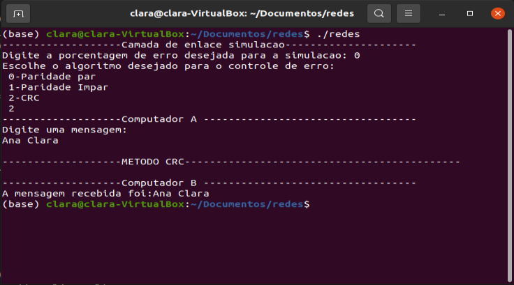

Ana Clara Amorim Andrade NºUsp: 10691992

Fábio Dias da Cunha NºUsp: 11320874

Lucas Gabriel de Araujo Silva NºUSP: 11218880

Matheus Godoy Bolsarini NºUsp: 9896201

# Link-Layer
Simulação da camada de enlace feita usadno c++.Projeto feito para a turma de redes de computadores.

## Especificação
Sistema Operacional: Linux Ubuntu 20.04

Compilador: Default Ubuntu GNU

## Uso

Rode o makefile na raiz do projeto:

```bash
make all
```

Basta rodar o executável. Para fazer isso digite no prompt de comando após rodar o makefile:

```bash
./redes
```




O usuário define a porcentagem de erro desejada para a simulação e qual algoritmo de detecção de erro deseja usar.
